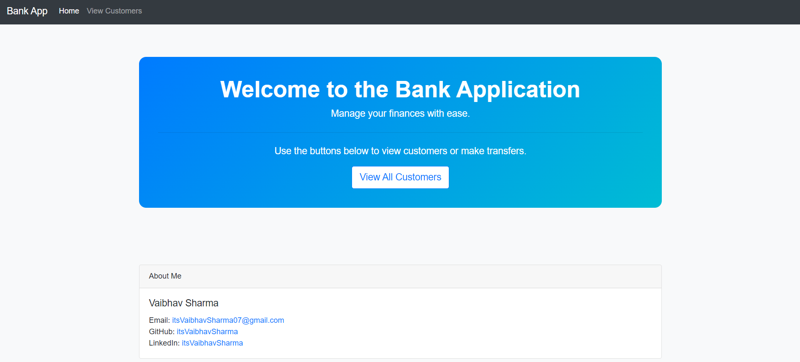
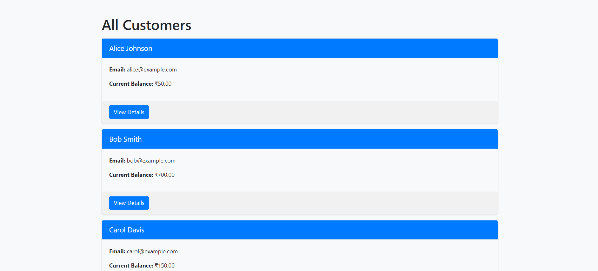
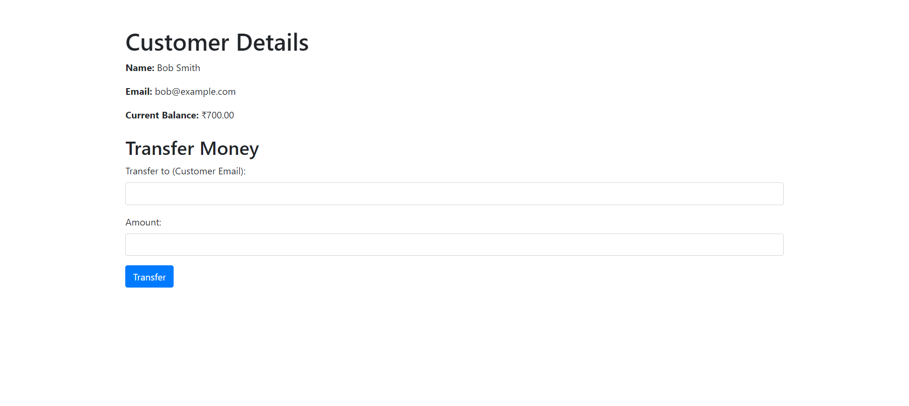
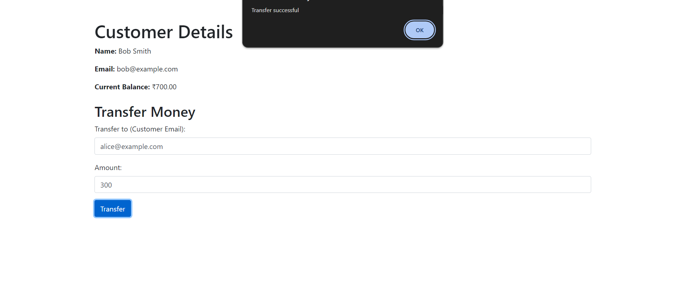
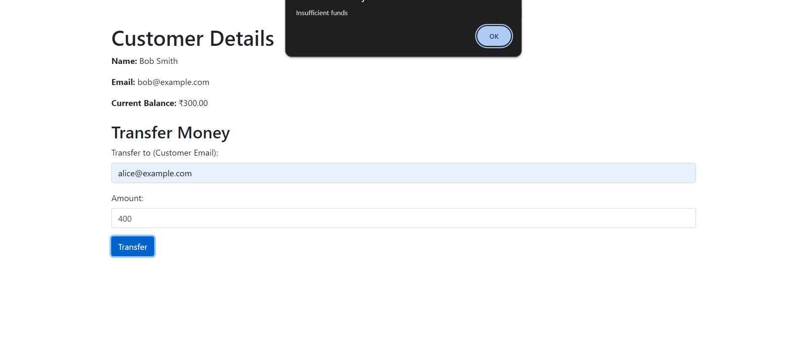

# Bank Application

This is a **Bank Application** built with **Express.js** and **MySQL**, allowing users to manage finances with features like viewing customer details, transferring money, and more. The application includes user authentication, error handling, and a clean, responsive interface for ease of use.

## Table of Contents

- [Features](#features)
- [Tech Stack](#tech-stack)
- [Installation](#installation)
- [Usage](#usage)
- [Screenshots](#screenshots)
- [Future Enhancements](#future-enhancements)
- [Contact](#contact)

## Features

- **Customer Management**: View all customers and their details.
- **Money Transfer**: Transfer money between customers with a balance check.
- **Transaction History**: Record each transaction securely.
- **Responsive Design**: The application is fully responsive and mobile-friendly.
- **Error Handling**: Middleware-based error handling for invalid inputs and server issues.
- **Input Validation**: Validate input fields using `express-validator`.
- **Environment Management**: Secure sensitive information with `dotenv`.

## Tech Stack

-  **Node.js**
-  **Express.js**
-  **MySQL**
-  **HTML5**
-  **CSS3**
-  **Bootstrap**
-  **JavaScript**
-  **dotenv**
-  **GitHub**

## Installation

1. Clone this repository:
   ```bash
   git clone https://github.com/itsVaibhavSharma/Basic-Banking-Application.git
   ```
2. Install the dependencies:
   ```bash
   npm install
   ```
3. Set up your MySQL database and update the connection details in the `db` object in `index.js`.
4. Start the application:
   ```bash
   npm start
   ```
5. Visit `http://localhost:3000` in your browser.

## Usage

### View All Customers

You can view all registered customers and their balances by navigating to the `View Customers` section.

### Transfer Money

Select a customer, enter the recipient’s email and amount to transfer money. The system ensures that the sender has sufficient funds.

### Error Handling

Invalid transfers (e.g., insufficient funds, invalid emails) will trigger descriptive error messages.

## Screenshots

### 1. **Home Page**

The main landing page showcasing the welcome message and key application features.



### 2. **Customer List**

The list of all customers along with their details such as balance and email.



### 3. **Customer Details**

The detailed view of an individual customer’s profile, including the option to transfer money.



### 4. **Money Transfer**

Interface to transfer money between customers, with error handling for invalid requests.



### 5. **Error Handling**

Examples of error messages displayed when invalid data is entered (e.g., insufficient funds or invalid email).



## Required SQL commands for the database

### 1. **Create the `customers` table**

This table stores customer details like name, email, and balance.

```sql
CREATE TABLE customers (
    id INT AUTO_INCREMENT PRIMARY KEY,
    name VARCHAR(100) NOT NULL,
    email VARCHAR(100) NOT NULL UNIQUE,
    current_balance DECIMAL(10, 2) NOT NULL DEFAULT 0.00
);
```

### 2. **Create the `transfers` table**

This table records the money transfers between customers, storing details like the sender’s and recipient’s email, and the amount transferred.

```sql
CREATE TABLE transfers (
    id INT AUTO_INCREMENT PRIMARY KEY,
    from_customer_email VARCHAR(100) NOT NULL,
    to_customer_email VARCHAR(100) NOT NULL,
    amount DECIMAL(10, 2) NOT NULL,
    transfer_date TIMESTAMP DEFAULT CURRENT_TIMESTAMP,
    FOREIGN KEY (from_customer_email) REFERENCES customers(email) ON DELETE CASCADE,
    FOREIGN KEY (to_customer_email) REFERENCES customers(email) ON DELETE CASCADE
);
```

### 3. **Sample Data Insertion (Optional)**

Inserting some sample data into the `customers` table to test the application:

```sql
INSERT INTO customers (name, email, current_balance) VALUES
('John Doe', 'johndoe@example.com', 5000.00),
('Jane Smith', 'janesmith@example.com', 3000.00),
('Alice Johnson', 'alicejohnson@example.com', 7000.00);
```

This will create a few customers with different starting balances.

## Future Enhancements

- **Transaction History**: Add a page where users can view the history of transactions.
- **User Authentication**: Implement login functionality for customers.
- **Improved UI/UX**: Refine the interface with better transitions and form validation feedback.

## Contact

**Vaibhav Sharma**

- GitHub: [itsVaibhavSharma](https://github.com/itsVaibhavSharma)
- LinkedIn: [itsVaibhavSharma](https://www.linkedin.com/in/itsVaibhavSharma)
- Email: [itsVaibhavSharma07@gmail.com](mailto:itsVaibhavSharma07@gmail.com)
